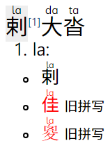
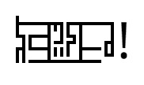

# koishi-plugin-xdi8

[](https://www.npmjs.com/package/koishi-plugin-xdi8)

[希顶语](https://wiki.xdi8.top/wiki/希顶语)与汉字互转

本插件提供 [`xdi8` 服务](#服务-api)。

基于本人维护的 npm 包 [xdi8-transcriber](https://github.com/DGCK81LNN/xdi8-transcriber)

## `xdi8` 指令

  > 指令：`xdi8 <text...>`
  >
  > 汉字希顶互转（实验性）
  >
  > 在文本前添加选项“-a”（与文本和指令名“xdi8”之间用空格隔开）来显示隐藏的结果，如过时拼写和希转汉时的部分繁体字。
  >
  > 当文本为单个汉字或不包含空格的希顶“词”时，即使未启用“-a”选项也会默认显示绝大多数隐藏结果。
  >
  > 可用的选项有：
  >
  >   * -a, --all  显示隐藏结果

## 字表更新

为使转写器的字表保持最新，本插件所使用的库 xdi8-transcriber 需要持续更新。若要更新 xdi8-transcriber，请在 Koishi 所在目录运行：

  * **npm:**

        npm update xdi8-transcriber

  * **yarn:**

        yarn up -R xdi8-transcriber

  * **Koishi 启动器:**

    <pre><code>koi yarn -n <mark><i>default</i></mark> up -R xdi8-transcriber</code></pre>

    其中“`default`”为 Koishi 实例名称。

## 示例

`xdi8 萤火虫`

```
nu3k ho ci3
```

`xdi8 地`

```
地:
dde（助词 de）
dDE（名词 dì）
```

`xdi8 怒发冲冠  奋发图强`

```
nAF jbia¹ mzu3² HB2  hu8H pio³ mb1 qT
```

```
[1] 发:
jbia（“髪”的简化字 fà）
pio（“發”的简化字 fā）
[2] 冲:
mzu3（“衝”的简化字）
Du3E（同“沖” 山间的平地；用于地名）
[3] 发:
pio（“發”的简化字 fā）
jbia（“髪”的简化字 fà）
```

`xdi8 tof H6H huT vnuV lYH`

```
施氏食狮史
```

`xdi8 NAh`

```
NAh:
曲（“麴”的简化字 酿酒或制酱时引起发醇的东西）
麹
麴
```

<code>xdi8\
nAF nE wiY vnuV\
nE wiY 4i6 n5i6\
wiY 4i6 wA 56</code>

```
怒尼威狮
尼威又鸡
威又乌犀
```

## 附加功能

### xegoe

  > 指令：`xegoe <text...>`
  >
  > 希顶字母图片
  >
  > 用希顶字体渲染希顶聊天字母或希顶字母 PUA 编码，或给汉字注音。
  >
  > 启用“`-x`”选项时，将关闭给汉字注音的功能，转而写出输入中希顶词对应的汉字。此模式下，希顶词之间需要用空格隔开。
  >
  > 可用的选项有：
  >
  >   * `-a, --all` 处理汉字时，显示所有可能的转写结果。
  >   * `-x, --x2h` 希顶转汉字模式

用 Xegoe UI 字体（希顶字母 PUA 编码版）将希顶语文本渲染成图片（或给汉字注音）。

希顶字母使用聊天字母或 PUA 编码表示皆可。

示例：

`xegoe ^Vnu8 AHL`

<pre></pre>

`xegoe 灯纟火社区`

<pre></pre>

`xegoe -xa la da ta`

<pre></pre>

### xdi8-grep

  > 指令：`xdi8-grep <pattern>`
  >
  > 从字表正则搜索希顶词
  >
  > 可以使用以下语法糖匹配特定种类的希顶字母：
  >
  >   * `\c` — 声母
  >   * `\g` — 介母
  >   * `\v` — 韵母
  >
  > 例如：“`\c\g\v.H`”匹配形如 _CGVRH_ 的希顶词。
  >
  > 将转义字母大写以选择补集，如 `\C` 匹配非声母。
  >
  > 可用的选项有：
  >
  >   * `-l`, `--legacy`  只搜索旧拼写

显示的搜索结果按汉字 Unicode 码位排序，有数量上限，可在插件配置中更改。超出上限时将随机抽取指定数量的结果显示，但正常拼写优先于过时拼写，正常拼写数量不足时才会用过时拼写补足数量。

示例：

`xdi8-grep H.*H`

```
兹 HVH（cí 只用于“龟（qiū）兹”）
呰 HuLoH（zǐ）
失 HEH
屒 H8pH
市 HTH
时 HoH
昝 H2H
棘 Hue2H
氏 H6H
洓 HueEH
熷 H3xH
甾 HuYH
矰 H37H
蚩 HuoH
髭 HuLjH
…共 26 条结果（2 条旧拼写）。
```

`xdi8-grep \c\g\v[^\CH]H`

```
宨 tiLfH
岹 7iLwH
崈 Bi3wH
帡 pi8pH
幉 diepH
攼 hi2rH（hàn）
曜 ciLbH
歂 DuYrH
炟 diaxH
煪 qu6xH
疒 bi8tH
赘 4iLxH
鬯 DuT4H
黯 Ni2bH
𫠊 xu2gH
…共 45 条结果（4 条旧拼写）。
```

`xdi8-grep (.).*\1.*\1`

```
幈 ppi8p
徊 VVfiV（旧拼写）
璱 33b63（旧拼写）
共 3 条结果（2 条旧拼写）。
```

`xdi8-grep -l .*VV.*`

```
彷 VVfT（旧拼写）
彺 VVwT（旧拼写）
往 VVka（旧拼写）
征 VVz8（旧拼写）
徇 VVxu8（旧拼写）
徉 VVyuT（旧拼写）
徊 VVfiV（旧拼写）
徕 VVlY（旧拼写）
徖 Bi3VV（旧拼写）
徘 pYVV（旧拼写）
徜 BTVV（旧拼写）
徝 VVH6（旧拼写）
徥 ti6VV（旧拼写）
徨 VVfiT（旧拼写）
忀 kiTVV（旧拼写）
…共 19 条结果。
```

### lnnzhyz

  > 指令：`lnnzhyz <text...>`
  >
  > 绘制 [LNN 中华语字](https://www.mywiki.cn/dgck81lnn/index.php/LNN_中华语字)（支持[希顶语方案](https://www.mywiki.cn/dgck81lnn/index.php/希顶语_LNN_中华语字方案)）
  >
  > “输入类型”可设为以下值：
  >
  >   * `xdi8` 或 `shidinn` — 希顶语（聊天字母）
  >   * `mandarin` — 普通话（「半魔改拼音」）
  >   * `notation` — LNN 中华语字通用序列化格式
  >
  > 也可使用类型名称的首字母作为短选项使用：`-x, -s, -m, -n`
  >
  > 可用的选项有：
  >
  >   * `-c, --compile`  仅将输入文本转换为通用序列化格式
  >   * `--type <type>`  输入类型

示例：

`lnnzhyz ^xdi8_aho!`

<pre></pre>

`lnnzhyz -m ni3_hau3, ^L_^N_^N ^zhung1_hua2_y3_z4!`

<pre></pre>

<code>lnnzhyz -c\
xdi8\
4oquV 4o_quV\
y353 y3_53</code>

    x+dien
    w+oo+quei woo_quei
    yj+eng+ngweng yjeng_ngweng

`lnnzhyz -cm xi1_ding3_deng1`

    xi_ieng~d_deng

`lnnzhyz -n $(lnnzhyz -cm xi1_ding3) $(lnnzhyz -c xdi8)`

<pre></pre>

## 服务 API

```ts
declare module "koishi" {
  interface Context {
    xdi8: Xdi8
  }
}

export class Xdi8 {
  /**
   * 获取或设置字表数据。
   *
   * 初始值为当前版本 xdi8-transcriber 所导出的 `data`。
   *
   * 修改此属性后再获取转写器，将重新构造新的转写器实例。
   */
  data: Data

  /** 汉字转希顶转写器实例。 */
  readonly hanziToXdi8Transcriber: HanziToAlphaTranscriber

  /** 希顶转汉字转写器实例。 */
  readonly xdi8ToHanziTranscriber: AlphaToHanziTranscriber
}
```

转写器对象的具体用法参见 [xdi8-transcriber](https://github.com/DGCK81LNN/xdi8-transcriber) 的文档。
